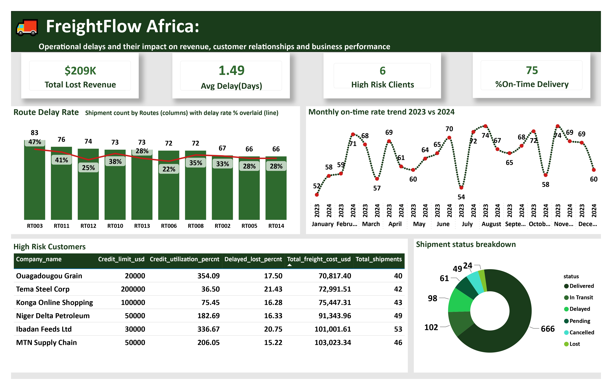

<h1>FreightFlowAfrica_Analysis</h1> 

<h3>FreightFlow Africa Dashboard</h3>

<h3>FreightFlow Africa ERD DIAGRAM</h3>

<h4>The schema centers on a `shipments` fact table linked to `clients`, `routes`, `drivers`, and `warehouses`. Each shipment record ties a client to a route (origin/destination depot pair) and carries delivery status and delay metrics — this is what made it possible to roll delay analysis up from the shipment level to the route level and the client level in the same query set.</h4>

<h3>209,000 lost to delayed/lost shipments — 11.6% of total 2023–2024 revenue</h3>
<h3>1.5 days** average delivery delay, network-wide</h3>
<h3>6 of 20 clients** are high-risk (>15% of shipments delayed/lost), representing **$614,625** in freight spend</h3>
<h3>RT003 (Lagos–Kano)** and **RT011 (Accra–Lomé)** are the worst-performing routes, at 47% and 41% late-arrival rates</h3>

<h2>What problem were you solving?</h2>
<h4>FreightFlow Africa, in its first two years of operation, generated approximately $1.36M in total revenue across a client base of 20 companies.</h4>
<h4>At the close of year two, leadership wanted to understand whether the business was at risk of losing any clients — and if so, what was driving that risk.</h4>

<h2>Why did it matter?</h2> 
<h4>As FreightFlow Africa approached its second year of steady growth, leadership wanted to identify operational weaknesses proactively — before they scaled the business further.</h4>
<h4>Expanding on top of unresolved delivery and reliability issues would only amplify losses and client attrition at a larger scale, making early detection critical to a sustainable expansion.</h4>

<h2>What approach did you take?</h2>
<h4>SQL Server (SSMS):Data storage, querying, and analysis</h4>
<h4>Power BI: Dashboard and data visualisation</h4>
<h4>GitHub:Version control and portfolio hosting</h4>
<h4>dbdiagram.ioEntity Relationship Diagram (ERD)</h4>

<h2>What challenges did you face?</h2> 
<h4>The biggest challenge wasn't technical — it was framing. The business question ('are we at risk of losing clients, and why?') could be approached from several angles: revenue analysis, delay/operations analysis, or client behavior analysis.
</h4>
<h4>Early attempts to lead with a pure revenue trend (month-over-month lost revenue) produced a noisy, inconclusive picture that didn't clearly answer the 'why.' Reframing the investigation around operational root causes and then connecting those findings back to specific high-risk clients produced a much clearer and compelling story.</h4>

<h2>What did your analysis reveal, and What recommendations would you make?</h2>

<h3>Total lost revenue:</h3>
<h4>$209,000 was lost due to delayed and lost shipments. This accounts for 11.6% of the total revenue made in the years 2023 and 2024. But lost revenue doesn’t show a steady upward trend,
instead it fluctuates from month to month as seen by how February 2024 improves by 68% against February 2023 while May And July did not fair well compared to the previous year.</h4>
<h4>This means that the loss isn’t steady but inconsistent and unpredictable which suggests that the root cause is tied to unforeseen circumstances such as a bad month for the route or driver or vehicle rather than a systematic decline across the network.</h4>
<h4>Despite its low number, this loss represents a client that was left unsatisfied because of late or lost shipment and if unchecked could lead to two outcomes: return customers churning and pricing power because customers start negotiating discounts or penalty clauses.</h4>
<h3>Recommendation:</h3>
<h4>I recommend the business prioritize investigating the root cause of the delayed or lost shipments in those specific months to determine the root cause and determine if it was a route, client or driver issue.</h4>

<h3>Average delay in days:</h3>
<h4>On average it takes approximately an extra day and half for shipments to be delivered. This may not seem like much but continuous delay means that the business is unreliable.</h4>
<h4>This will increase customer churn and damage brand reputation. The Kumasi-Accra route(both directions)is the worst performing route pair averaging 2.15-2.64 delay days well above the 1.5 delays days average.  The Lagos-Kano routes comes in second at 2.19 delays days. Since these 3 routes are causing the upward pull on the average delay, investigations should begin with them specifically instead of treating it as a uniform issue among all routes.</h4>
<h3>Recommendation:</h3> 
<h4>its the same as the above for finding the root cause for the extra delay in shipments being delivered. And discovering which routes and warehouses are responsible for the extra delays. Start by auditing Drivers assignments, road-type/traffic level, and vehicle condition.</h4>

<h3>High risk clients</h3>
<h4>6 clients were found to have more than 15% of their shipment either delayed or lost. Although it seems like a small amount of clients out of the total 20 but losing any of these clients will mean a drop in revenue for the business as the revenue generated rom these 6 clients amount to $614,625 in total freight spend.</h4>
<h4>The analysis already shows that high risk customers like MTN supply chain routes a majority of their shipments Kumasi Depot and Accra central, the two least performing routes.</h4>
<h3>Recommendation:</h3>
<h4>Rather than investigating the whole network, The business should first audit driver’s assignments, vehicle condition and warehouse maintenance in relation to the two routes since fixing them will reduce the chances of the affected clients churn.</h4>

<h3>Route Delay Rate</h3>
<h4>Lagos Hub to Kano Depot (RT003) has the highest delay rate — 47% of its 83 shipments arrived late. Accra Central to Lome Depot (RT011) follows closely, with 41% lateness across 76 shipments.</h4>
<h4>However, delay rate doesn't scale with shipment volume: Kano to Abuja Depot handled a comparable 74 shipments but only 25% arrived late — nearly half the rate of RT003 despite similar volume. This suggests lateness is driven by route-specific conditions rather than sheer traffic.</h4>
<h3>Recommendation:</h3> <h4>Treat delay as an isolated, route-level issue rather than a volume-driven one. Investigate RT003 and RT011 individually — likely candidates are distance, road/border conditions, carrier assignment, or handling at specific depots — rather than assuming a general capacity problem.</h4>

